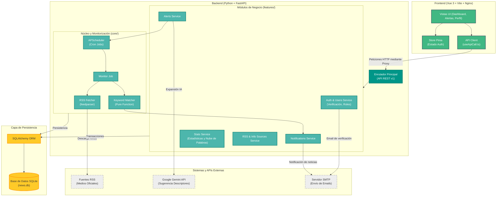

```mermaid

flowchart TB
    %% Estilos
    classDef frontend fill:#41B883,stroke:#35495E,stroke-width:2px,color:#fff;
    classDef backend fill:#009688,stroke:#00796B,stroke-width:2px,color:#fff;
    classDef core fill:#4DB6AC,stroke:#00796B,stroke-width:2px,color:#fff;
    classDef database fill:#FFCA28,stroke:#FF8F00,stroke-width:2px,color:#333;
    classDef external fill:#EEEEEE,stroke:#9E9E9E,stroke-width:2px,stroke-dasharray: 5 5,color:#333;

    %% Nodos Externos
    subgraph External ["Sistemas y APIs Externas"]
        RSS["Fuentes RSS\n(Medios Oficiales)"]:::external
        Gemini["Google Gemini API\n(Sugerencia Descriptores)"]:::external
        SMTP["Servidor SMTP\n(Envío de Emails)"]:::external
    end

    %% Frontend
    subgraph Frontend ["Frontend (Vue 3 + Vite + Nginx)"]
        UI["Vistas UI (Dashboard, Alertas, Perfil)"]:::frontend
        Pinia["Store Pinia\n(Estado Auth)"]:::frontend
        API_Client["API Client\n(useApiCall.ts)"]:::frontend
        
        UI --> Pinia
        UI --> API_Client
    end

    %% Backend
    subgraph Backend ["Backend (Python + FastAPI)"]
        Router["Enrutador Principal\n(API REST v1)"]:::backend
        
        subgraph Features ["Módulos de Negocio (features/)"]
            AuthService["Auth & Users Service\n(Verificación, Roles)"]:::core
            AlertService["Alerts Service"]:::core
            NotifService["Notifications Service"]:::core
            StatsService["Stats Service\n(Estadísticas y Nube de Palabras)"]:::core
            RSSService["RSS & Info Sources Service"]:::core
        end
        
        subgraph Procesamiento ["Núcleo y Monitorización (core/)"]
            Scheduler["APScheduler\n(Cron Jobs)"]:::core
            Monitor["Monitor Job"]:::core
            Fetcher["RSS Fetcher\n(feedparser)"]:::core
            Matcher["Keyword Matcher\n(Pure Function)"]:::core
        end
        
        Router --> Features
        
        %% Conexiones internas backend
        AlertService --> Scheduler
        Scheduler --> Monitor
        Monitor --> Fetcher
        Monitor --> Matcher
        Matcher --> NotifService
        
        %% Conexiones hacia el exterior
        AlertService -->|Expansión IA| Gemini
        AuthService -->|Email de verificación| SMTP
        NotifService -->|Notificación de noticias| SMTP
        Fetcher -->|Descarga feeds| RSS
    end

    %% Capa de Datos
    subgraph CapaDatos ["Capa de Persistencia"]
        ORM["SQLAlchemy ORM"]:::database
        SQLite[("Base de Datos SQLite\n(news.db)")]:::database
        
        ORM --> SQLite
    end

    %% Conexiones principales
    API_Client -->|Peticiones HTTP mediante Proxy| Router
    Features -->|Transacciones| ORM
    Procesamiento -->|Persistencia| ORM
```

