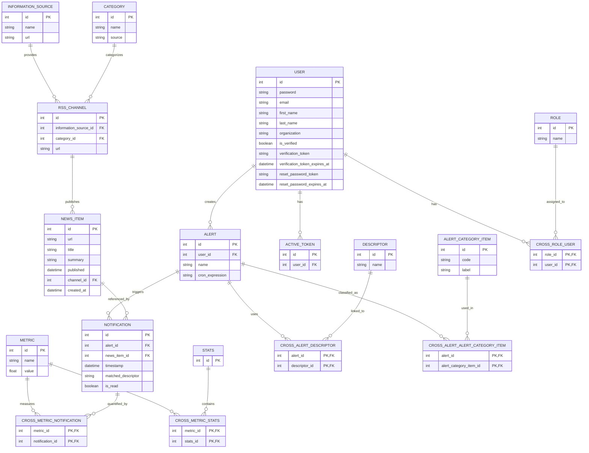

```mermaid

erDiagram

    USER {
        int id PK
        string password
        string email
        string first_name
        string last_name
        string organization
        boolean is_verified
        string verification_token
        datetime verification_token_expires_at
        string reset_password_token
        datetime reset_password_expires_at
    }

    ROLE {
        int id PK
        string name
    }

    INFORMATION_SOURCE {
        int id PK
        string name
        string url
    }

    CATEGORY {
        int id PK
        string name
        string source
    }

    DESCRIPTOR {
        int id PK
        string name
    }

    ALERT_CATEGORY_ITEM {
        int id PK
        string code
        string label
    }

    METRIC {
        int id PK
        string name
        float value
    }

    STATS {
        int id PK
    }

    ACTIVE_TOKEN {
        int id PK
        int user_id FK
    }

    ALERT {
        int id PK
        int user_id FK
        string name
        string cron_expression
    }

    NEWS_ITEM {
        int id PK
        string url
        string title
        string summary
        datetime published
        int channel_id FK
        datetime created_at
    }

    NOTIFICATION {
        int id PK
        int alert_id FK
        int news_item_id FK
        datetime timestamp
        string matched_descriptor
        boolean is_read
    }

    RSS_CHANNEL {
        int id PK
        int information_source_id FK
        int category_id FK
        string url
    }

    CROSS_ROLE_USER {
        int role_id PK, FK
        int user_id PK, FK
    }

    CROSS_ALERT_DESCRIPTOR {
        int alert_id PK, FK
        int descriptor_id PK, FK
    }

    CROSS_METRIC_NOTIFICATION {
        int metric_id PK, FK
        int notification_id PK, FK
    }

    CROSS_ALERT_ALERT_CATEGORY_ITEM {
        int alert_id PK, FK
        int alert_category_item_id PK, FK
    }

    CROSS_METRIC_STATS {
        int metric_id PK, FK
        int stats_id PK, FK
    }

    %% Relationships

    USER ||--o{ ACTIVE_TOKEN : has
    USER ||--o{ ALERT : creates

    ALERT ||--o{ NOTIFICATION : triggers
    NEWS_ITEM ||--o{ NOTIFICATION : referenced_by

    RSS_CHANNEL ||--o{ NEWS_ITEM : publishes
    INFORMATION_SOURCE ||--o{ RSS_CHANNEL : provides
    CATEGORY ||--o{ RSS_CHANNEL : categorizes

    %% Many-to-many via junction tables

    USER ||--o{ CROSS_ROLE_USER : has
    ROLE ||--o{ CROSS_ROLE_USER : assigned_to

    ALERT ||--o{ CROSS_ALERT_DESCRIPTOR : uses
    DESCRIPTOR ||--o{ CROSS_ALERT_DESCRIPTOR : linked_to

    METRIC ||--o{ CROSS_METRIC_NOTIFICATION : measures
    NOTIFICATION ||--o{ CROSS_METRIC_NOTIFICATION : quantified_by

    ALERT ||--o{ CROSS_ALERT_ALERT_CATEGORY_ITEM : classified_as
    ALERT_CATEGORY_ITEM ||--o{ CROSS_ALERT_ALERT_CATEGORY_ITEM : used_in

    METRIC ||--o{ CROSS_METRIC_STATS : aggregated_in
    STATS ||--o{ CROSS_METRIC_STATS : contains
```
